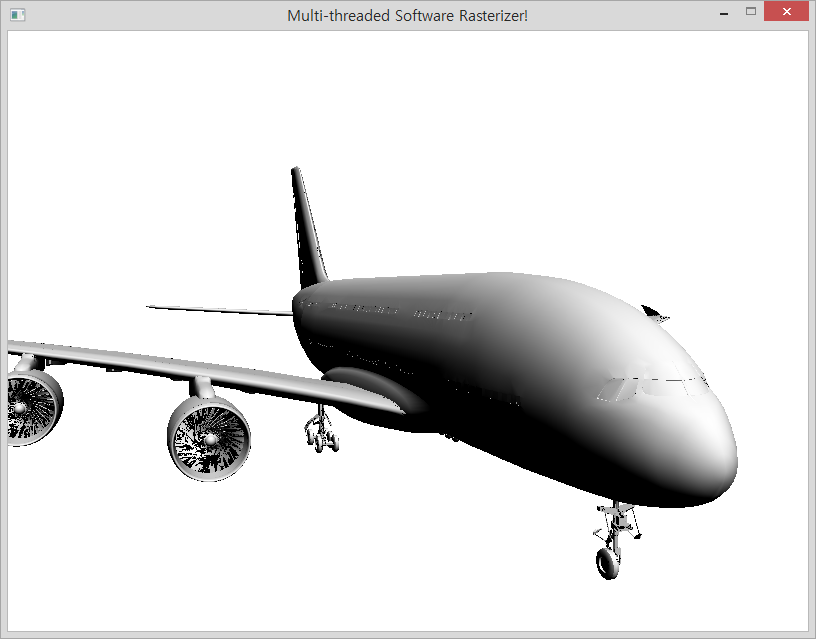

Multi-Threaded Software Rasterizer
========

SNU 4190.311A, 2013 Fall



### Members

* [Hyeon Kim](https://github.com/simnalamburt)
* 이효원

--------

### Debug environment setting

1.  **Executable** → *Right Click* → `Properties`

1.  `Configuration:` → `All Configurations`

1.  `Configuration Properties` → `Debugging`

1.  `Debugger to launch:` → `Local Windows Debugger`

1.  `Environment` → `˅` → `Edit`

1.  Add a following line

    ```
    PATH=%PATH%;$(SolutionDir)Intel TBB\bin\ia32\vc11;$(SolutionDir)FBX\lib\x86\$(Configuration)
    ```
